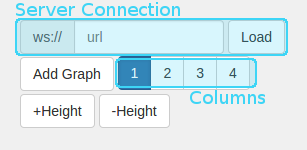

L3P3-Dashboard-repository
=========================

## Overview

L3p3-Dashboard is a visual web framework and it is a part of the L3P3 project (Online failure prediction), one of the projects developed in the [Center for Open Middleware](http://www.centeropenmiddleware.com).  

The goal of this visual web framework is to create a set of representations using the best visual techniques 
and technologies for each representation type. These representations are used to support data analysis 
in the rest of project, but also test current analysis and visualization techniques. Also, the repository contains a set of 
tools to supports visualizations. 

## Repository structure

The repository is divided into three branches: two stable branches and one for development. 

The [master](https://github.com/centeropenmiddleware/l3p3-dashboard/tree/master) branch contains a stable version 
with views that can be used by anyone without code modifications. These views are ready to use and there are routines to configure them. 
 
The [devel](https://github.com/centeropenmiddleware/l3p3-dashboard/tree/devel) contains all views, both stable and under development views.

In addition, there may be other branches for certain demos or to perform experimental developments

The repository structure is divided in tree folders: 

* **dashboard**: Contains the web page structure. 
* **images**: Contains the sources of the images uses in the web page. 
* **tools**: Contains the set of tools that supports visualizations. 

## Framework

### Framework design

The base framework design uses bootstrap to create the visual aspect. It is designed as a web page that loads the different views in the main tag of the body. The views are loaded dynamically using a javascript template (*.ejs). 
Furthermore, the framework uses third party libraries to manipulate the visual aspect of the web page. These are jQuery and some of its extensions


The loaded views are divided in three types. These are the following: 
* The first type are generic use views. These views can be 
used with data that fit the view requirements. These views have routines to configure data origins without code 
modifications. They are "Distribution charts" and "Online data viewer". 
* The second type views are not oriented towards generic use, but COM internal use instead because they are linked to specific data. To use these 
views, code modification is needed. These views are "Single Node Viewer" and "Global Events Viewer".
* The Three type are demo view to test the functionality of a specific library. There is a demo view, "Demo D3 Plus"

### Views

#### Dynamic Distribution Charts

The objective of this view is to represent in a chart the population distribution of a data set. 


The view can load databases, the only requirement is that the database must be in csv format. When a new database is 
loaded, the system asks what the type of the attributes (continuous, discrete, id or date) are. At this 
moment, discrete and continuous types are supported and date will be supported in the future.
  


The distribution chart is shown when a database and population attribute are selected. The chart type depends on the type of the attribute. If the type is discrete, the representation is a bar chart, however, if the type is continuous, the representation is a density function (line chart). Furthermore, the continuous attribute can be represented as a probability density function or a cumulative density function.     


Optionally the population can be categorized by a discrete attribute. If a category is selected, the chart (line or bar) is divided in category values.


 
The database values can be filtered, these filters have been applied to the population and category attributes,

The database can be filtered by population and category attributes; furthermore, secondary filters for other attributes can be added. 

##### Repository files

* **view**: [template_dynamicDistribution.ejs](https://github.com/centeropenmiddleware/l3p3-dashboard/blob/master/dashboard/js/templates/template_dynamicDistribution.ejs) 
* **logic**: [dynamicDistribution.js](https://github.com/centeropenmiddleware/l3p3-dashboard/blob/master/dashboard/js/src/dynamicDistribution.js) 

##### Technologies and libraries 

This view has been created with javascript and it uses third party libraries to render the charts. These 
libraries are: 

* **[d3.js](https://github.com/mbostock/d3)**: This has been the main library, used to create SVG images in 
javascript.    

* **[dc.js](https://github.com/dc-js/dc.js)**: This library is used to manipulate d3.js and create the charts. This library and crossfilter.js have been selected because they support the largest amount of data of all alternatives. 

* **[crossfilter.js](https://github.com/square/crossfilter)**: This library is used to manipulate data. This library
 and dc.js have been selected because they support the largest amount of data of all alternatives.

* **[science.js](https://github.com/jasondavies/science.js)**: This library is used to calculate the accumulated 
density function from a set of points.
 
#### Online Data Viewer

The objective of this view is show data served online.  

The view connects to a server using web-socket technology. The controls permits set the web socket url, 
the number of graphs per line, the data refresh time, the alarm threshold and the height of the graphs 
 


Each graph show the timeline of each group of resources and its name with the current value. The controls attached to 
the graphs can pause, resume and save the current state, allow you to dynamically represent the range of values 
​​represented and set how many data is shown in the graph. 
 
The alarm column shows the alerts produced by the system. A alarm is generated when a resource exceeds the threshold 
set. The alarms can be shown in the graphs and they can be deleted from the list. 

The controls allows the following:
* Connect to a server
* Modify the height of the graphs
* Modify the threshold level
* Modify the number of graph per line

##### Communication Client-Server

The communication between client and server is done using web-sockets, this technology allows to send messages from the 
server to the client. The client start the communication to establish a connection, then the server send the messages. They 
must be following these rules: 

* The first message must be the description of the sources, the format is \[\<sourceName\>.\<sourceNodeName\>\[$\[\<minValue\>@]\<maxValue\>\] \]+. 
E.g: for 4 nodes (node1, node2, node3 and node4) and tree sources per node (src1, src2 and scr3) the message sent must be 
```node1.src1$0@100 node1.src2$0@100 node1.src3$0@100 node2.src1$0@100 node2.src1$100 node2.src3 node3.src1 node3.src3$0@100 node3.src2$0@100 node4.src1$0@100 node4.src3$0@100 node4.src2$0@100```

* The following messages must be the values for each source. Must have values for all 
sources and they must be separated by spaces. E.g: ```3 1 30 9 0 17 18 0 35 21 0 37``` 

The communication technology used to communicate the client and server is web socket. This technology allows to send a 
a line for time step. The format of the messages sent from server to client must be:

##### Repository files
 
* **view**: [template_comp_resources.ejs](https://github.com/centeropenmiddleware/l3p3-dashboard/blob/master/dashboard/js/templates/template_comp_resources.ejs)
* **logic**: [onlineResourceViewer.js](https://github.com/centeropenmiddleware/l3p3-dashboard/blob/master/dashboard/js/src/onlineResourceViewer.js)

##### Technologies and libraries

* **[smoothie](http://smoothiecharts.org/)**: This library is used to create the graphs. 

#### Single node Viewer & Global Events Viewer

This view is a ad hoc representation of the resources and events of a set of nodes along the time. This view uses 
Javascript libraries to optimize the load of big dataset. 
 
##### Technologies and libraries

* **[d3.js](https://github.com/mbostock/d3)**: This has been the main library, used to create SVG images in 
javascript.    

* **[dc.js](https://github.com/dc-js/dc.js)**: This library is used to manipulate d3.js and create the charts. This library and crossfilter.js have been selected because they support the largest amount of data of all alternatives. 

* **[crossfilter.js](https://github.com/square/crossfilter)**: This library is used to manipulate data. This library
 and dc.js have been selected because they support the largest amount of data of all alternatives.

##### Repository files
 
* **view**: [template_singleNodeViewer.ejs](https://github.com/centeropenmiddleware/l3p3-dashboard/blob/master/dashboard/js/templates/template_singleNodeViewer.ejs) 
and [template_globalEventsViewer.ejs](https://github.com/centeropenmiddleware/l3p3-dashboard/blob/master/dashboard/js/templates/template_globalEventsViewer.ejs)
* **logic**: [globalEventsViewer.js](https://github.com/centeropenmiddleware/l3p3-dashboard/blob/master/dashboard/js/src/globalEventsViewer.js) 
and [singleNodeViewer.js](https://github.com/centeropenmiddleware/l3p3-dashboard/blob/master/dashboard/js/src/singleNodeViewer.js)

#### Predictor View

The objective of this view is show the online predictions of a prediction server.


The view connects to a online prediction server using web-socket technology and represent the information sent by the 
server. To understand this view is necessary to define some concepts: 
 
* *event*: occurrence happening in a system.
* *event type*: classification of events of the same type. 
* *prediction*: probability of an event happen. This value is shown as an percentage.
* *prediction result*: the result of a prediction based on a threshold. The result can be hit, false positive and false negative
* *hit*: When a prediction is correct, it is when it is predicted that a event type will occur and it happens. 
* *false positive*: when it is predicted that a event type will occur and it not happens
* *false negative*: when it is not predicted that a event type will occur and it happens
* *alert*: Message about a event. In this moment there are two alerts. Alert "on" indicates that the event is 
going to occur in the prediction window. Alert "off" indicates that the event is not going to occur in the prediction window

##### Predictor Areas

The view is divided into three parts. The principal is the central area and it has the predictions graph, the footer contains 
information about the selected graph and the left column has controls to configure the graph, add new graph or prediction 
server.

###### Central area

The central area contains the graphs with the online predictions, prediction results and events. The graphs are divided 
in observation and prediction window separates by threshold line. This graph has the following elements: 


* *Events*: These elements are represented with a vertical line and can only be in the observation window. 
The event name can be visible and, if the event is selected, extra information about it is shown. 
* *Prediction*: The predictions are represented with a line across the graph. There is only one line for each event 
because the line is changing over the time with the prediction values, this allows observing the values that the 
prediction has been taking. If a prediction is selected, the prediction line is thicker. The prediction is shown 
in percentage. 
* *Prediction result*: These elements show the result of a prediction, i.e. if the prediction was successful or 
there has been a false negative or true negative. The success is represented with a green check, 
the false negative with a orange cross and the true negative with a red cross. 

In addiction, each graph has a set of graph-controls in the left. These controls are the following: 

* *Select graph*: It allows to select a graph to show its extra information. Further, the new sockets are loaded 
in the graph selected. 
* *Show-hide names*: It shows/hides the names of the event in the graph. It allows better see the graph
* *Pause graph*: It allows to pause the graph. When a graph is paused, the events continue being registered and it is 
shown when the graph is resumed
* *Delete graph*: It removes a graph and disconnects from the prediction server
 
At the right of the events there is a summary of the events. They are number of occurrences of the event type in 
the graph and if this event type is alarmed. The events are sorted alphabetically but the alarmed events are at top of 
the list. If the mouse is over a event or has been clicked, it is selected and all information about it is highlighted

###### Footer

The footer contains information of the graph selected. This information is divided in four tables:


* *Events*: It shows all events and its information, the list is sorted temporarily. 
* *Event predictions*: It shows the actual predictions of the events. The prediction is shown in percentage. 
* *Prediction results*: It shows the predictions results over the time. The results prevail although not within time 
window. The list can be cleaned with the "clean button". 
* *Alerts*: It shows the alerts of the system. 

###### Left column

The left column contains the controls to configure the graph, this controls are the following:


 
* *Server Connection*: It indicates the web-socket url of the prediction server. The server is linked with a selected 
graph. 
* *Add Graph*: It adds a new graph to the central area. 
* *Columns*: Is allows to indicate the number of graph is shown in a line. Increment the number of graphs per line 
causes the graph area is less increment the number of graph per line. 
* *Heigh+ / Height-*: It increments or decrements the height of the graph. 

##### Communication Client-Server

The communication between client and server has requisites of two types. The first type of requisites is about the 
information needed, the second type is about how sending the information
  
###### Information requirements 

There are 5 types of messages. These are the following: 

* **Add Event**: This message indicates that a type of event has occur in the system. This message must indicate the following
  * *Type of event*: the type event that occurs.   
* **Set prediction**: This message indicates a new prediction value of a event type. This message must indicate the following
  * *Type of event*: the type event predicted.
  * *Prediction*: the value od the prediction. 
* **New prediction result**: This messages indicates the result of a prediction. This message must indicate the following: 
  * *Type of event*: the type event predicted.
  * *result*: The result of the prediction, this value can be "hit", "false positive" or "false negative".
* **Set alert**: Indicates a new prediction alert. This message must indicate the following:
  * *Type of event*: the type event predicted.
  * *Alarm value*: The type of alarm. this value can be "on" and "off". 
* **Set windows time**: This message indicates the windows time, observation and prediction. This message must indicate the following:
  * *Observation window* time: The time of the observation window.  
  * *Prediction window* time: The time of the prediction window. 

###### Format requirements

The format of the messages has been selected arbitrarily and it can be changed to adapt to the requirements of the server. 
The messages must be a string in json format. They are the following: 

* **Add Event**: This message indicates that a type of event has occur in the system. The attributes are the following: 
  * *command*: "event"
  * *event*: \<eventTypeName\>
* **Set prediction**: This message indicates a new prediction value of a event type. The attributes are the following:
  * *command*: "prediction"
  * *event*: \<eventTypeName\>
  * *prediction*: \<predictionValue\>, percentage format
* **New prediction result**: This messages indicates the result of a prediction. The attributes are the following: 
  * *command*: "result"
  * *event*: \<eventTypeName>
  * *result*: \<hit|miss-fp|miss-fn\>
* **Set alert**: Indicates a new prediction alert. The attributes are the following: 
  * *command*: "alert"
  * *event*: \<eventTypeName\>
  * *alert*: \<on|off\>
* **Set windows time**: This message indicates the windows time, observation and prediction. The attributes are the following: 
  * *command*: "time"
  * *before*: \<time\>, time of the observation window, it is optional and it is indicates in milliseconds 
  * *after*: \<time\>, time of the prediction window, it is optional and it is indicates in milliseconds 

##### Repository files

* **view**: [template_predictor.ejs](https://github.com/centeropenmiddleware/l3p3-dashboard/blob/master/dashboard/js/templates/template_predictor.ejs)
* **logic**: [predictorView.js](https://github.com/centeropenmiddleware/l3p3-dashboard/blob/master/dashboard/js/src/predictorView.js)


##### Technologies and libraries 

The Javascript libraries used in the code are the following: 

* **[d3.js](https://github.com/mbostock/d3)**: This library is used tu create the vector drawing except the graphs. 
 This includes the event lines, extra information of events and prediction results. 

* **[smoothie](http://smoothiecharts.org/)**: This library is used to create the graphs. This library paint the 
line that represent the prediction
   
<!--In addiction of this libraries, the view uses other technologies and libraries used commonly as bootstrap, jQuery, HTML5 and CSS3--> 

#### Network Graph Life Cycle

TODO
<!--
Objetivo de la vista,incluir capuras

Partes de la vista. Central, Pie, Izquierda
Central, que vemos y que podemos hacer, incluido el slider
Pie, que vemos y que podemos hacer
Izquierda, que vemos y que podemos hacer

Requisitos de los ficheros.
CSV: Cabeceras, columnas obligatorias y opcionales
JSON: Para que se usa, estructura
Estadisticas: no se
-->

##### Repository files

* **view**: [template_NG_LC.ejs](https://github.com/centeropenmiddleware/l3p3-dashboard/blob/master/dashboard/js/templates/template_NG_LC.ejs)
* **logic**: [NetworkGraphLifeCycle.js](https://github.com/centeropenmiddleware/l3p3-dashboard/blob/master/dashboard/js/src/NetworkGraphLifeCycle.js)

##### Technologies and libraries 

* **[d3.js](https://github.com/mbostock/d3)**: This library is used to read the csv files. 

* **[vis.js](http://visjs.org/)**: This library is used to create the graph 

#### D3 Plus Demos

The objective of this view is test the library and its useful in the dashboard. So we've reproduced the graphs that this library can do.

##### Repository files

* **view**: [template_NG_LC.ejs](https://github.com/centeropenmiddleware/l3p3-dashboard/blob/master/dashboard/js/templates/template_d3p.ejs)
* **logic**: [d3plusDemo.js](https://github.com/centeropenmiddleware/l3p3-dashboard/blob/master/dashboard/js/src/d3plusDemo.js)

##### Conclusions 

This library is one more in the set of libraries that works over d3. It is simple and has a good catalogue of graph 
and it has a useful tools to manage colors, text and shapes, but, as most, the library not work good with a big data sets.
    
It is useful if there is a specific graph that fits to your needs


#### Creating a new view

The clear routines must be implemented in the clear function, it is called when the view is changed. The content div 
resizes when the containing window resizes. The resizing routines of the view are delegated to the template. 

Each view has a entry in the views array. (routines.js-> views) Each entry is a object whose attributes are ref 
(the reference to the template), id (id of the view), title (the title of the view), constantPrefix (the string prefix 
used to identify the view constants) and js (the reference to the main javascript file).   
 

The content view 


<!--Type of view and its objectives, View, Implementation details and technologies used, dataset format, principal Developers and contributions ventajas y desventajas de las librerías utilizadas)-->

## Tools

The tools are made to supports the views. These are useful to debug applications or to serve files. 

<!-- Documentation template for tools

### moduleName

**Route**.

**Programing environment**. 

**Modules and technologies**.  
 
**Executable**. 

**Explain**.

-->  

### onlineDataViewerServer

**Route**. /tools/onlinedataviewerserver

**Programing environment**. Node.js / Javascript

**Modules and technologies**. *express*: allows to create servers, *filesystem*: Read and write files, *ws*: for creating
  web-sockets servers, more easy that using express
 
**Executable**. *server.js*

**Explain**. This module serves a csv file. each line of the csv file is served every so often, this time is defined in 
  *TIME_OUT* constant. This module supports the onlinedataview. 
<!-- This is in the private repository
### predictor

**Route**. /tools/predictor

**Programing environment**. Node.js / Javascript 

**Modules and technologies**. 
 
**Executable**. 

**Explain**.
-->

### fileServer

**Route**. /tools/fileServer 

**Programing environment**. Node.js / Javascript  

**Modules and technologies**. *express*: allows to create servers, *filesystem*: Read and write files
 
**Executable**. *server.js*: serves files with web-sockets. *client.js*: tests the server

**Explain**. This module serves files using web-socket technology. With web-sockets technology a big files can be served 
  better than http technology. The path of the file served is defined in the *fileServed* variable. 


### CSV-Gen

**Route**. /tools/csv-gen

**Programing environment**. Node.js / Javascript

**Modules and technologies**. *Filesystem*: Read and write files 
 
**Executable**. *generator.js*, *networkGen.js*

**Explain**. This module generate csv files of different types. 

The first type, generated by *generator.js*, generates big csv files with pseudo random content. 
   The size of this files is defined in a variable inside the code, *iterations*. This files have multiple columns, the first of them is the timestamp and it 
   is incremental, a random value between 0 and a constant defined in the code, *MAX_TIME*. The rest of columns are random 
   values with the as follows: \<nFile\>x\<nColumn\>V\<randomValue\> where *nFile* is the number of csv file [0..nFiles-1], *nColumn* is 
   the column inside the file [1..valuesPerFile] and randomValue is random value defined in rangeValue variable.
     
The second type, generated by *networkGen.js*, generates network graph and a set of transitions of the graph along 
   the time. This executable generate two files, the first of them has the json extension and it is the network graph description.
   The nodes used are defined in the *nodes* variable and its position coordinates are set to 0. A set of elements are used to generate
   the transitions. These elements are the defined in elements variable and the transitions are generated moving a element 
   to other node of the graph. The time and the node of the transition are selected random. The number of transitions are 
   defined in *row* variable, and the maximum time between transitions are defined in *timeRange* variable, the output 
   files are defined in *networkFileName* and *nodesFileName* variables
     
### web-socket-server

*/wss [\<nWS\>=\<alias\>]\**

**Route**. /tools/web-socket-server

**Programing environment**. Node.js / Javascript

**Modules and technologies**. *express*: allows to create servers, *filesystem*: Read and write files, *ws*: for creating
   web-sockets servers, more easy that using express, *keypress*: allows to create a input / output console interface
 
**Executable**. "server.js"

**Explain**. Create a web-socket server with a different functionalities. This server allows to send messages to the connected
   clients and run simulations. 
   
The call parameters are optionals and they are:
    
* debug: If you want to put in debug mode. 
* console: the console output is shown in the console. 
* out=\<fileName\>: the console output is saved in a file. If it is not defined, the console output is activated
* port: define the listen port of the server. the port by default is 10082
 
The console has two modes, the fist, general, is for general purpose. and the second, web socket, is to send messages to the clients 
connected. The supported commands are the following:

common:
 
* */exit*: to exit the console
* */ws*: interact with the second mode options. 
  * No options, change to the web socket mode and send in brodcast mode  
  * *-l* list of client connected
  * *\<nClient\>* change to the nClient
* */sim \<fileName\>* execute a simulation. fileName indicates the path of the simulation file

only in web-socket mode:

* */back* returns to the common mode
* */echo* The echo mode is activated for the client. It is that the message received from the client is forwarded

The */sim* command needs a simulation file. The repository has a example of this simulation. The format of this simulation is:
 
Configuration commands: they are before */start* sentence, at the moment the configuration sentence supported is 
*/wss /[/<nWS/>=/<alias/>/]**, where *nWS* is the number of client connected and the *alias* is the alias of the client in the
simulation sentences. The body of the simulation is between */start* and */end* sentences. The format of the 
simulation sentences are *\<time\> \<command\>* where *time* is the time of the sentence in the simulation, *command* is the 
command executed in the sentence. At this moment the command supported is *send \<wsAlias\> \<message\>* where *wsAlias* is the 
alias of the client and *message* is the message to send. Example: 

    /wss 0=ws1 1=ws0
    /start
    0 send ws0 {command:"time",before:300000, after:120000}
    0 send ws1 {command:"time",before:600000, after:180000}
    // comment
    1000 send ws0 {command:"event",event:"NodeId02_CPU_75"}
    10000 send ws0 {command:"event",event:"NodeId02_CPU_90"}
    12000 send ws0 {command:"event",event:"NodeId02_CPU_75"}
    15000 send ws0 {command:"prediction",event:"NodeId02_CPU_90",prediction:"22"}
    20000 send ws0 {command:"event",event:"NodeId02_Mem_75"}
    35000 send ws0 {command:"prediction",event:"NodeId02_CPU_90",prediction:"88"}
    35000 send ws0 {command:"prediction",event:"NodeId02_Mem_90",prediction:"75"}
    35000 send ws0 {command:"alert",event:"NodeId02_CPU_90",alert:"on"}
    35000 send ws0 {command:"alert",event:"NodeId02_Mem_90",alert:"on",time:10000}
    40000 send ws0 {command:"event",event:"NodeId02_CPU_90"}
    40000 send ws0 {command:"result",event:"NodeId02_CPU_90",result:"hit"}
    45000 send ws0 {command:"prediction",event:"NodeId02_CPU_90",prediction:"99"}
    45000 send ws0 {command:"alert",event:"NodeId02_CPU_90",alert:"on",time:10000}
    55000 send ws0 {command:"prediction",event:"NodeId02_CPU_90",prediction:"0"}
    55000 send ws0 {command:"result",event:"NodeId02_CPU_90",result:"miss-fp"}
    60000 send ws0 {command:"event",event:"NodeId02_CPU_90"}
    60000 send ws0 {command:"result",event:"NodeId02_CPU_90",result:"miss-fn"}
    /end

The view has been created to support the prediction view. It is not finished and there will be more commands and simulation sentences.

## known bugs

TODO
 ## Technology summary

 This chapter summarizes the libraries and technologies used in the views to represent the data

 ### Javascript libraries

 #### jQuery

 #### [d3.js](https://github.com/mbostock/d3)

 * Description:D3.js is a JavaScript library for manipulating documents based on data. D3 helps you bring data to life
 using HTML, SVG and CSS. D3’s emphasis on web standards gives you the full capabilities of modern browsers without
 tying yourself to a proprietary framework, combining powerful visualization components and a data-driven approach to
 DOM manipulation.

 * Views: Distribution Charts, Single Node viewer, Global Events viewer, Online Data Viewer, Network Graph Life Cycle,
   predictor Monitor, D3 Plus Demo

 * Good points: Very powerful to create svg content, It is the base of others libraries and the library contains useful
   tools as csv reader.

 * Bad points: Very complex to use.

 #### [dc](http://dc-js.github.io/dc.js/)

 * Description: dc.js is a javascript charting library with native crossfilter support and allowing highly efficient
 exploration on large multi-dimensional dataset (inspired by crossfilter's demo). It leverages d3 engine to render charts
 in css friendly svg format. Charts rendered using dc.js are naturally data driven and reactive therefore providing instant
 feedback on user's interaction. The main objective of this project is to provide an easy yet powerful javascript library
 which can be utilized to perform data visualization and analysis in browser as well as on mobile device.

 * Views: Distribution Charts, Single Node viewer, Global Events viewer

 * Good points: It is simple create graphs. The native crossfilter support allows highly efficient with big datasets

 * Bad points: Perform advanced graphics modifications is difficult and can damage the advantages of the library with large volumes of data

 #### [d3plus](http://d3plus.org/)

 * Description: d3plus is an extension to the D3 library that allows fast and easy creation of data visualizations.

 * Views: D3 Plus Demo

 * Good points: Simple to create graphs and big catalogue of graphs

 * Bad points: Poor performance with big data sets because It doesn't has native crossfilter support.

 #### [smoothie](http://smoothiecharts.org/)

 * Description: Smoothie Charts is a really small charting library designed for live streaming data.

 * Views: Online Data Viewer, predictor Monitor

 * Good points: small library, good documentation on its website, good visual aspect, easy to use when the library
 has been understood how it works

 * Bad points: The library has problems when the graph area is resized. It is not possible to update the graph if it is
 paused. Difficult to manage the zero point.


 #### [Science](https://github.com/jasondavies/science.js/)

 * Description: Science.js is a JavaScript library for scientific and statistical computing.

 * Views: Distribution Charts

 * Good points: Powerful science library, contains various implementations of statistical methods similar to those
   provided by R,

 * Bad points: Por documentation, The graphs results are statics.

 #### [Crossfilter](http://square.github.io/crossfilter/)

 * Description: Crossfilter is a JavaScript library for exploring large multivariate datasets in the browser

 * Views: Distribution Charts, Single Node viewer, Global Events viewer, Online Data Viewer, Network Graph Life Cycle,
   predictor Monitor, D3 Plus Demo

 * Good points: Fast to manage large data sets

 * Bad points: Nothing special

 #### [vis](http://visjs.org/)

 * Description: Vis.js is a dynamic, browser based visualization library. The library is designed to be easy to use,
 to handle large amounts of dynamic data, and to enable manipulation of and interaction with the data. The library
 consists of the components DataSet, Timeline, Network, Graph2d, and Graph3d.

 * Views: Network Graph Life Cycle,

 * Good points: Easy to use,

 * Bad points: He said that can manipulate large amount of dynamic data but our test has problems with it.

 ### nodeJS

 #### Express

 * Description: Express is a minimal and flexible Node.js web application framework that provides a robust set of features for web and mobile applications.

 * Tools: onlineDataViewerServer, fileServer,  web-socket-server.

 * Good points: Allows to create server easily and quickly.

 * Bad points: Nothing special

 #### WS

 * Description: Simple to use, blazing fast and thoroughly tested websocket client, server and console for node.js

 * Tools: onlineDataViewerServer, web-socket-server.

 * Good points: It is easy to use

 * Bad points: Nothing special

 #### Keypress

 * Description:

 * Tools: web-socket-server.

 * Good points: Easy way to create a console with advanced features as up-arrow for last command used

 * Bad points: Nothing special

 #### Filesystem

 * Description: File I/O is provided by simple wrappers around standard POSIX functions

 * Tools: onlineDataViewerServer, fileServer, CSV-Gen, web-socket-server.

 * Good points: The most useful filesystem library of Node.js

 * Bad points: Nothing special


## Developers and contributors

Jose Manuel Navarro (@josemanuelnavarro) was the first developer, but now he is out of development work

At this time, Francisco Huertas (@fhuertas) is the main developer of the dashboard and he is the responsible of the dashboard architecture.

Mario Pérez (@MarioPerezEsteso) is involved in the last stages of the development of the "Network Graph Cycle" view.

Federico Fernandez (@FedericoFdez) and Jorge Ramírez (@jramirezc93) have contributed a in the development of "Online data viewer" view. 
 
The developers views are the following:  

* **Distribution charts**: Main developer Francisco Huertas (@fhuertas) 
* **Online data viewer**: Main developer: Francisco Huertas (@fhuertas), contributors: Federico Fernandez (@FedericoFdez) and Jorge Ramírez (@jramirezc93)
* **Network Graph Cycle**: Main developers: Francisco Huertas (@fhuertas) and Mario Pérez Esteso (@MarioPerezEsteso)
* **Predictor Monitor**: Main developer: Francisco Huertas (@fhuertas)
* **Single Node Viewer**: Main developer: José Manuel Navarro (@josemanuelnavarro), contributor: Francisco Huertas(@fhuertas)
* **Global Events Viewer**: Main developer: José Manuel Navarro (@josemanuelnavarro),contributor: Francisco Huertas(@fhuertas)

<!--## Acknowledgment
	
TODO
-->


 
